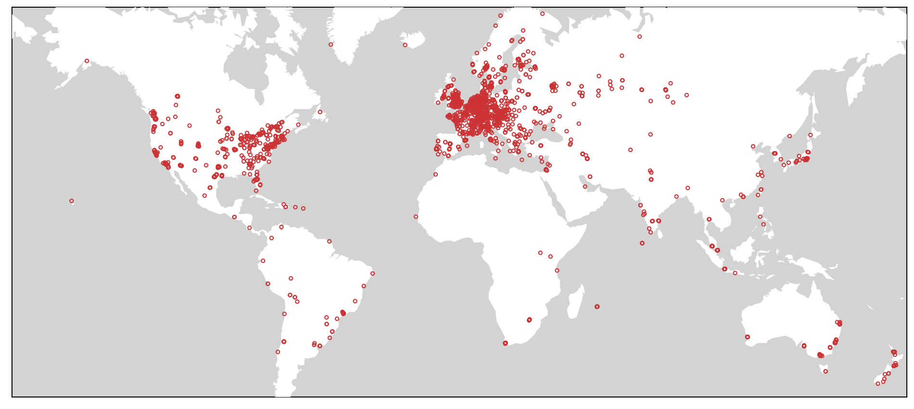

### Evaluating Public DNS Services in the Wake of Increasing Centralization of DNS

Trinh Viet Doan | Justus Fries | Vaibhav Bajpai  
Technical University of Munich

[IFIP Networking 2021](https://networking.ifip.org/2021/), June 21&ndash;24, 2021.

---

### Vantage Points

The DNS measurement and `traceroute` datasets were collected from ~2.5k RIPE Atlas home probes.  
A map of these home probes is shown below.

An extended set of 10.6k RIPE Atlas probes were used to determine the distribution of on-probe resolvers.

### Requirements

The datasets are stored in `sqlite3` databases, aggregations and analyses are performed using Python scripts and `jupyter` notebooks.  
Required Python dependencies are listed in [`requirements.txt`](https://github.com/tv-doan/ifip-net-2021-dns/blob/master/requirements.txt) and can be installed using `pip3 install -r requirements.txt`.

For the calculation of CDFs and drawing of the corresponding plots, [`Pmf.py` &rarr;](http://greenteapress.com/thinkstats/Pmf.py) and [`Cdf.py` &rarr;](http://greenteapress.com/thinkstats/Cdf.py) from [Think Stats &rarr;](https://greenteapress.com/wp/think-stats-2e/) are used.

### Measurement Datasets and Results

The main measurements using the 2.5k home probes were performed with the [`./ripe-atlas-dns-week-msm.py`](https://github.com/tv-doan/ifip-net-2021-dns/blob/master/ripe-atlas-dns-week-msm.py) script.  
The measurement results can be retrieved from the RIPE Atlas API through the measurement IDs, which are listed in [`./metadata/msm_id_list.csv`](https://github.com/tv-doan/ifip-net-2021-dns/blob/master/metadata/msm_id_list.csv).  
An example script to fetch the data is provided with [`./ripe-dns-fetch.py`](https://github.com/tv-doan/ifip-net-2021-dns/blob/master/ripe-dns-fetch.py).  
It is recommended to follow up this process with the [`./DNS-cleanup.ipynb`](https://github.com/tv-doan/ifip-net-2021-dns/blob/master/DNS-cleanup.ipynb) notebook.

The IDs of the one-off measurements (from the 10.6k probes) are listed in [`./metadata/msm_id_list_all_ipv4_probes.csv`](https://github.com/tv-doan/ifip-net-2021-dns/blob/master/metadata/msm_id_list_all_ipv4_probes.csv) and [`./metadata/msm_id_list_all_ipv6_probes.csv`](https://github.com/tv-doan/ifip-net-2021-dns/blob/master/metadata/msm_id_list_all_ipv6_probes.csv), respectively.  
The [`./ripe-dns-all-probes.ipynb`](https://github.com/tv-doan/ifip-net-2021-dns/blob/master/ripe-dns-all-probes.ipynb) notebook can be used to fetch and pre-process the results of these measurements.

The `traceroute` measurement IDs are listed in the [`./metadata/msm_id_list_traces_to_*.csv`](https://github.com/tv-doan/ifip-net-2021-dns/blob/master/metadata/) files.  
The measurements and result retrieval were all performed with [`./ICMP-traceroute-msm.ipynb`](https://github.com/tv-doan/ifip-net-2021-dns/blob/master/ICMP-traceroute-msm.ipynb).

This repository contains (most of) the required code, metadata, and table schemas to reproduce the results, see below for further instructions.

### Repeating the analysis
Move the modules to the right locations:
- `Pmf.py` &rarr; [`./data-aggregation/`](https://github.com/tv-doan/ifip-net-2021-dns/blob/master/data-aggregation/) and [`./plotting/`](https://github.com/tv-doan/ifip-net-2021-dns/blob/master/plotting/)
- `Cdf.py` &rarr; [`./data-aggregation/`](https://github.com/tv-doan/ifip-net-2021-dns/blob/master/data-aggregation/) and [`./plotting/`](https://github.com/tv-doan/ifip-net-2021-dns/blob/master/plotting/)

After fetching the data as outlined above, run the `jupyter` notebooks in the [`./data-aggregation/`](https://github.com/tv-doan/ifip-net-2021-dns/blob/master/data-aggregation/) directory to process and aggregate the raw datasets.  
The notebooks in the [`./plotting/`](https://github.com/tv-doan/ifip-net-2021-dns/blob/master/plotting/) directory can then be used to generate the plots presented in the paper.  
All plots are saved under [`./plots/`](https://github.com/tv-doan/ifip-net-2021-dns/blob/master/plots/).

Note: The required metadata lookups were already done and are stored in the [`./metadata/`](https://github.com/tv-doan/ifip-net-2021-dns/blob/master/metadata/) directory. The directory contains the scripts used to retrieve the metadata.

### Contact

Please feel welcome to contact the authors for further details.

- Trinh Viet Doan (<doan@in.tum.de>) (corresponding author)
- Justus Fries (<justus.fries@tum.de>)
- Vaibhav Bajpai (<bajpaiv@in.tum.de>)
